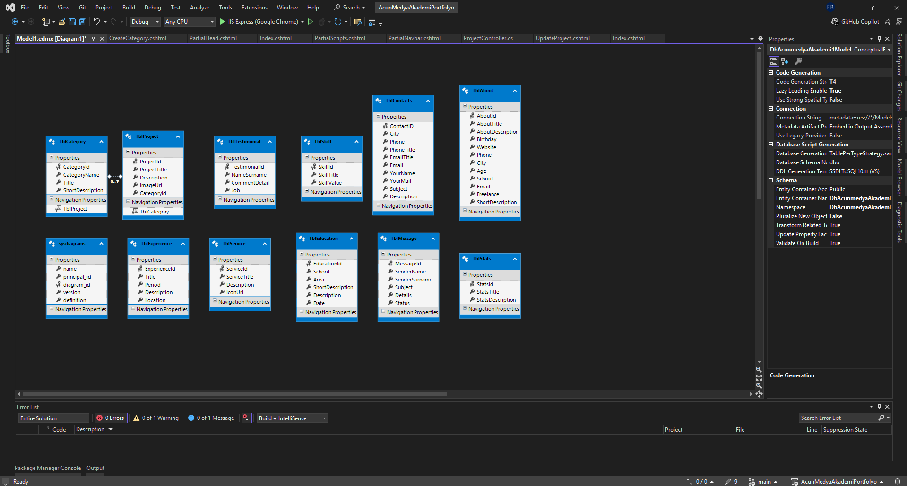
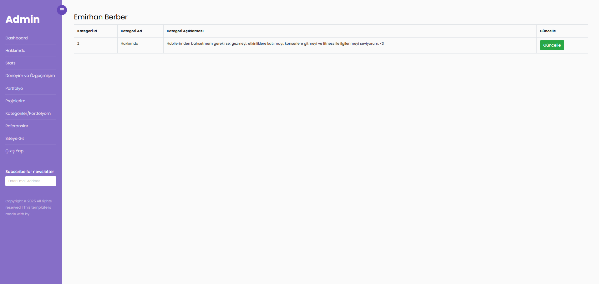
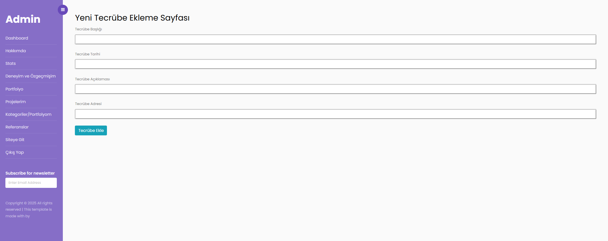
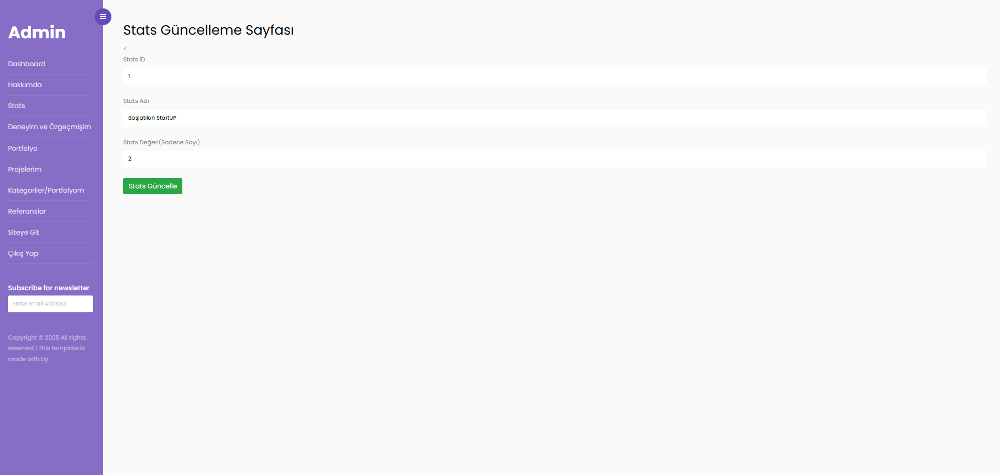

# ✨ AcunMedyaAkademi MVC Portfolyo Case ✨  

Bu proje, **AcunMedyaAkademi C# ile Programlama** eğitimi kapsamında ödev olarak hazırlanmıştır.  

## 🚀 Proje Özellikleri  

- 🌟 **Dinamik Veri Yönetimi**: Kullanıcı bilgileri dinamik olarak eklenebilir, güncellenebilir ve silinebilir.  
- 🛠️ **Admin Paneli**:
  - ➕ Ekle  
  - 🗑️ Sil  
  - ✏️ Güncelle  
  - 📋 Listele özellikleri eklendi.  
- 🧭 **Navigasyon**:  
  - NavBar ve Sidebar özellikleri ile sayfalar arası yönlendirme sağlandı.  
- 🔗 **Sosyal Medya Entegrasyonu**:  
  - Kullanıcıları sosyal medya hesaplarına yönlendiren bağlantılar eklendi.  
- 💬 **Mesaj Gönderme Özelliği**:  
  - Site ziyaretçileri, iletişim paneli aracılığıyla mesaj bırakabilir.  

## 💻 Kullanılan Teknolojiler  

- ⚙️ **ASP.Net MVC Framework**: Proje altyapısı.  
- 🛡️ **Entity Framework**: ORM aracı olarak kullanıldı.  
- 🗄️ **MSSQL Server**: Veritabanı altyapısı oluşturuldu.  
- 🎨 **HTML, CSS, Bootstrap**: Arayüz iyileştirmeleri yapıldı.  
- 🔍 **LINQ Sorguları**: Veri sorgulama işlemleri için eklendi.  
- 📂 **PartialView**: Sayfalar arası geçişleri kolaylaştırmak için kullanıldı.  

---

## 📸 Proje Görselleri  

### 📚 Proje Veritabanı Modeli
  

### 🛠️ Admin Paneli Hakkımda Örneği
  

### 🛠️ Admin Paneli Tecrübe Oluşturma Örneği
  

### 🛠️ Admin Paneli Stats Güncelleme Örneği

